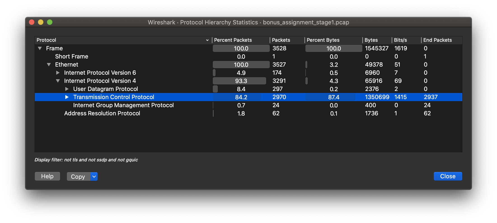

# BSY bonus task report

This report describes step by step solution of bonus task present in Security Systems course on Czech Technical University.

## ⚡️ First stage

We are receiving a pcap file, unique token, and server information as the entry point to this assignment — the pcap file you can find in this repo. Other provided information is listed below.

- server: `192.168.1.167:9292`
- my token identificator for this task: `HorribleDancer`

First of all, let's check out what we can find on this server just by running `ncat 192.168.1.167 9292` command on my virtual server in BSY network. Getting result:

```text
***************************************************************
Bonus assignment part 1. Not relevant to other assignemnts.
****************************************************************


<Grinch> Please provide your token
HorribleDancer
<Grinch> What is the IP of the C&C?

<Grinch> What is the periodicity of the communication in seconds? (Remove decimals, for example 122.7 becomes 122)

<Grinch> How many times did the victim computer connect to the C&C IP?

<Grinch> Was any malicious executable downloaded (Yes/No)?

```

So now I have a bunch of question which can be answered after pcap analysis.

### pcap analysis

From the obtained questions, we can estimate that the pcap file is capturing some kind of attack. We know this attack may use Command and Control botnet, and we can detect this by some periodically repeated action. When we open the capture file in most popular capture analysis software [Wireshark](https://www.wireshark.org/), it's clear that it has precisely 10000 records and 2:07 hours duration. 

